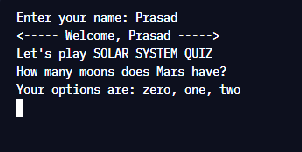
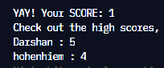

# Solar System - cli quiz app

This is a simple cli app which asks questions about our solar system, takes answer as the input and displays the score. Built with NodeJS.

## Overview

### Screenshots





### Links

- Live Site URL: [live site on replit](https://replit.com/@DarshanDamre/solar-system-quiz?embed=true#index.js)

## My process

### Built with

- NodeJS

### What I learned

Learned how to take input from the user and store it using [readline-sync npm package](https://www.npmjs.com/package/readline-sync).

```js
const welcome = () => {
  let userName = readlineSync.question("Enter your name: ");

  console.log(
    `<----- Welcome, ${userName} -----> \nLet's play SOLAR SYSTEM QUIZ`
  );
};
```

## Author

- Twitter - [@DarshanDamre](https://twitter.com/DarshanDamre)
- LinkedIn - [Darshan Damre](https://www.linkedin.com/in/darshandamre/)
- Website - [Darshan Damre](https://darshandamre.netlify.app/)
